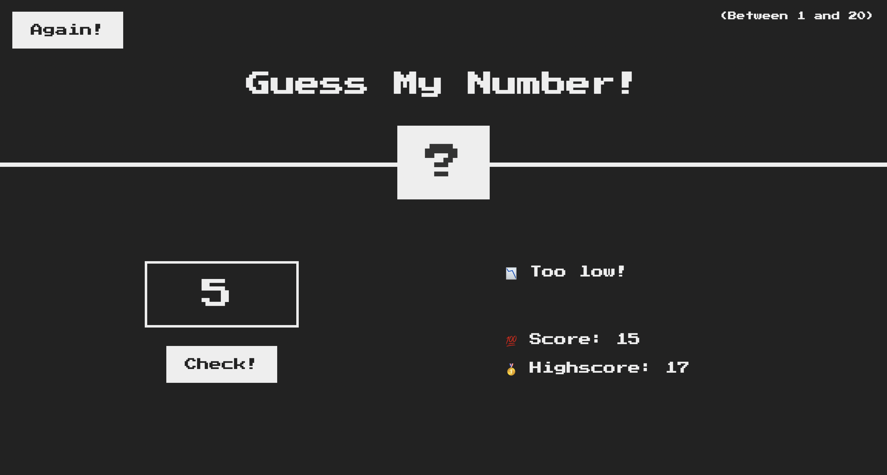
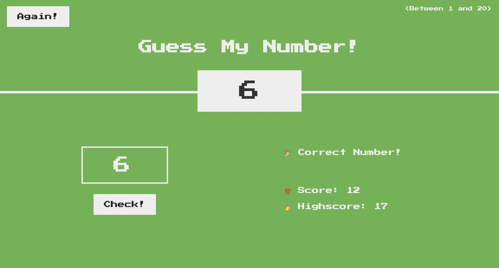
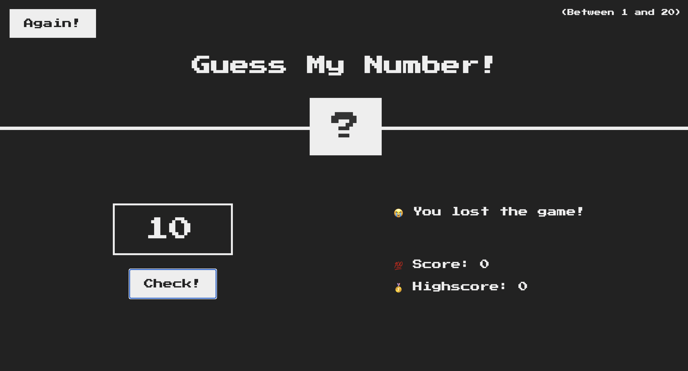

# GuessMyNumber

This is a simple number guessing game built using JavaScript, HTML, and CSS. The game generates a random secret number between 1 and 20. The player has to guess the secret number by entering their guess. Based on the input, the game gives feedback:

If no number is entered, it displays "⛔️ No Input."   
If the guess is correct, it shows "🎉 Correct Number!" and changes the background color to green.    
If the guess is too high or too low, it gives hints ("📈 Too high!" or "📉 Too low!") and reduces the player's score by 1.   
If the score reaches 0, the player loses with the message "😭 You lost the game!"   
The player can reset the game by clicking the "Again" button, which restores the score and generates a new secret number. The game also tracks the highest score achieved during the session.

